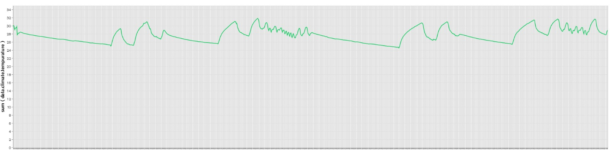
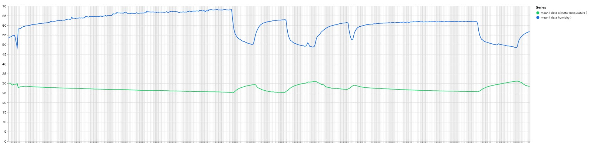
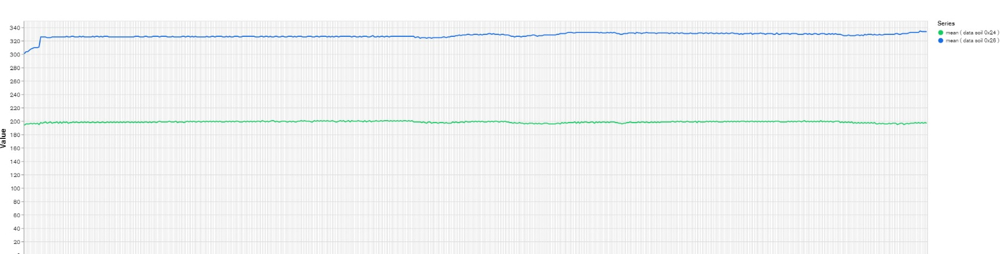
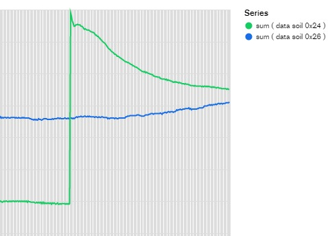

# AzureSpherePlantMonitor
A simple Azure Sphere app to periodically monitor and publish sensor data. Automatically polls data from two [chirp! soil moisture](https://github.com/Miceuz/i2c-moisture-sensor) sensors, a [SHT31D tempurature/humidity](https://www.adafruit.com/product/2857) sensor, and a [LPS22H pressure](https://www.st.com/en/mems-and-sensors/lps22hb.html) sensor through a [LSM5DSO Gyro](https://www.st.com/en/mems-and-sensors/lsm6dso.html). Data is then translated into a JSON package and uploaded through Azure IoT to an [Azure Function](https://github.com/prototypicalpro/LambdaWorkspace/tree/master/azureplant), which loads this data into a MongoDB. This program was built for the [AVNET Azure Sphere MT3620 Starter Kit](https://www.avnet.com/shop/us/products/avnet-engineering-services/aes-ms-mt3620-sk-g-3074457345636825680/), but should still operate on other hardware given correct configurations.

Examples of the data collected is shown below. Charts were created using MongoDB Charts.
 * Temperature data over one day: 
 * Temperature data compared with humidity data over one day: 
 * Soil moisture data over one day from both sensors: 
 * Soil moisture data reacting to the plant being watered: 

Internally, this program uses [libeuv](https://github.com/troglobit/libuev) for thread-safe events and [C-Macro-Collections](https://github.com/LeoVen/C-Macro-Collections) for message queues. Sensors are polled every 2 minutes, and the resulting messages are uploaded ever 10 minutes. In the event of a network disconnection, messages are queued until the network is reconnected or the queue becomes full. A global state machine keeps track of the current network state, triggering reconnection attempts with exponential backoff on disconnection. Messages that fail to send due to the network disconnecting are re-queued in no particular order, and as a result the ordering of messages is not guarenteed (but can be reassembled using the message timestamp). 

This setup has proven very reliable, as the current deployment has been running for 2 months now (3/23/2020) with no issues.
