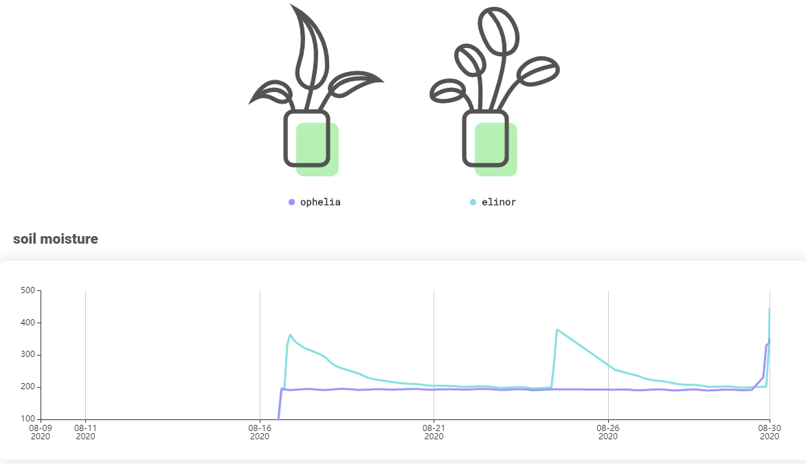

# Azure Sphere Plant Monitor ([Sprout](https://mirrorkey.dev/Sprout))

|  |  |
|:---:|:---:|

An Azure Sphere app to periodically monitor and publish sensor data about some houseplants to a [public dashboard](https://mirrorkey.dev/Sprout). Automatically polls data from two [chirp! soil moisture](https://github.com/Miceuz/i2c-moisture-sensor) sensors, a [SHT31D tempurature/humidity](https://www.adafruit.com/product/2857) sensor, and a [LPS22H pressure](https://www.st.com/en/mems-and-sensors/lps22hb.html) sensor through a [LSM5DSO Gyro](https://www.st.com/en/mems-and-sensors/lsm6dso.html). Data is then translated into a JSON package and uploaded through Azure IoT to an [Azure Function](https://github.com/prototypicalpro/LambdaWorkspace/tree/master/azureplant), which loads this data into a MongoDB hosted on Atlas. After this data is loaded, it can queried by the [SproutServerless Lambda](https://github.com/mirrorkeydev/SproutServerless) and served to the [Sprout Dashboard](https://github.com/mirrorkeydev/Sprout). 

This program was built for the [AVNET Azure Sphere MT3620 Starter Kit](https://www.avnet.com/shop/us/products/avnet-engineering-services/aes-ms-mt3620-sk-g-3074457345636825680/), but should still operate on other hardware given correct configurations.

Examples of the data collected is shown below. Current readings of all of these sensors can also be viewed on the [Sprout dashboard](https://mirrorkey.dev/Sprout).
 * Temperature data over one day: 
 * Temperature data compared with humidity data over one day: 
 * Soil moisture data over one day from both sensors: 
 * Soil moisture data reacting to the plant being watered: 

Internally, this program uses [libeuv](https://github.com/troglobit/libuev) for thread-safe events and [C-Macro-Collections](https://github.com/LeoVen/C-Macro-Collections) for message queues. Sensors are polled every 2 minutes, and the resulting messages are uploaded ever 10 minutes. In the event of a network disconnection, messages are queued until the network is reconnected or the queue becomes full. A global state machine keeps track of the current network state, triggering reconnection attempts with exponential backoff on disconnection. Messages that fail to send due to the network disconnecting are re-queued in no particular order, and as a result the ordering of messages is not guarenteed (but can be reassembled using the message timestamp). 

This project is a collaboration between [Melanie Gutzmann](https://github.com/mirrorkeydev) (dashboard + api) and [Noah Koontz](https://github.com/prototypicalpro) (api + IoT data collection).

